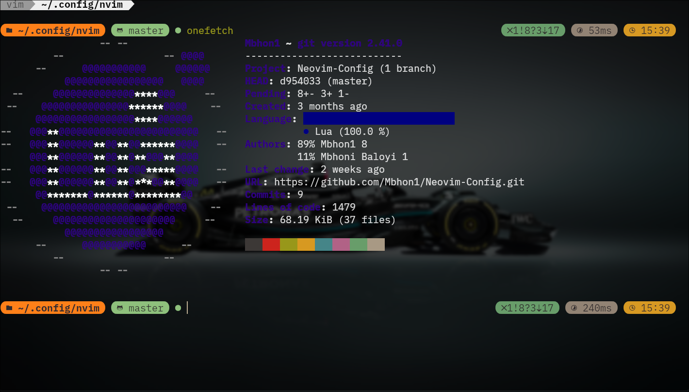
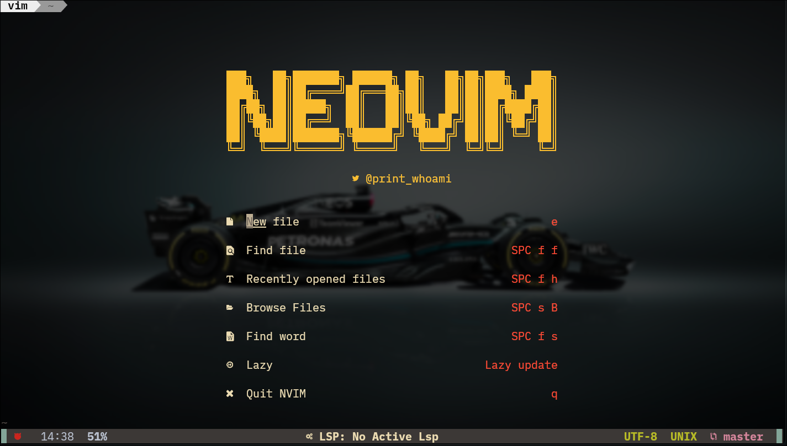
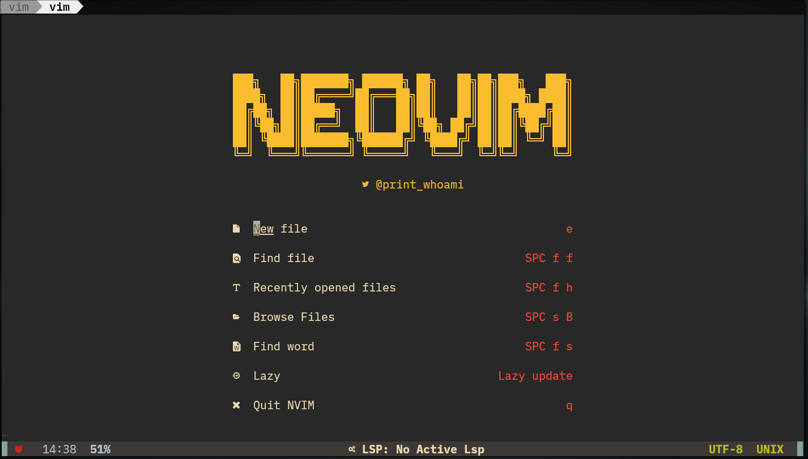
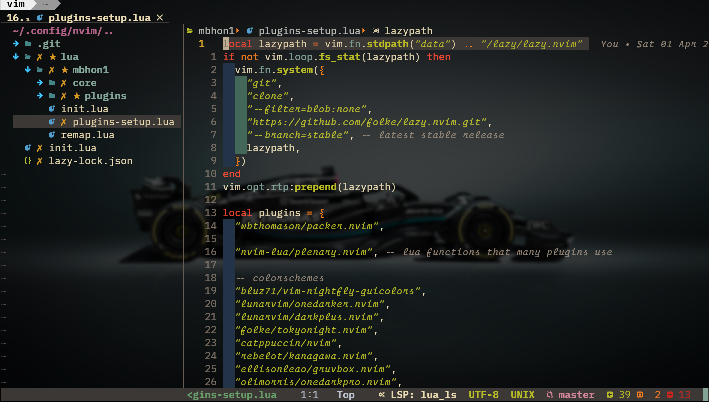
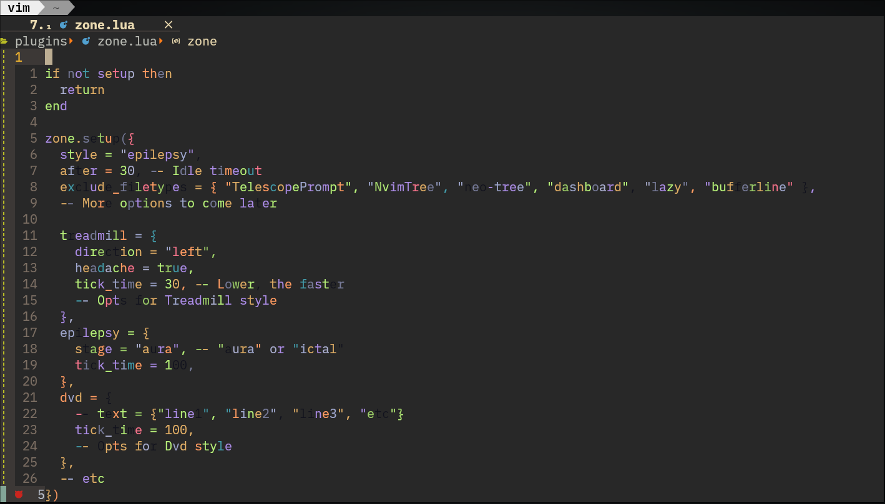
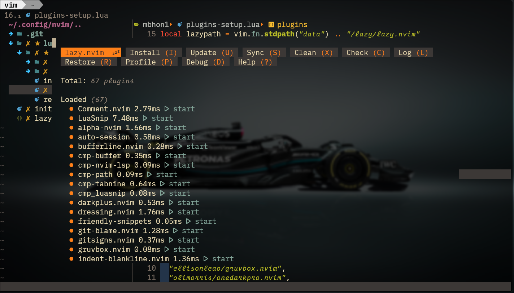
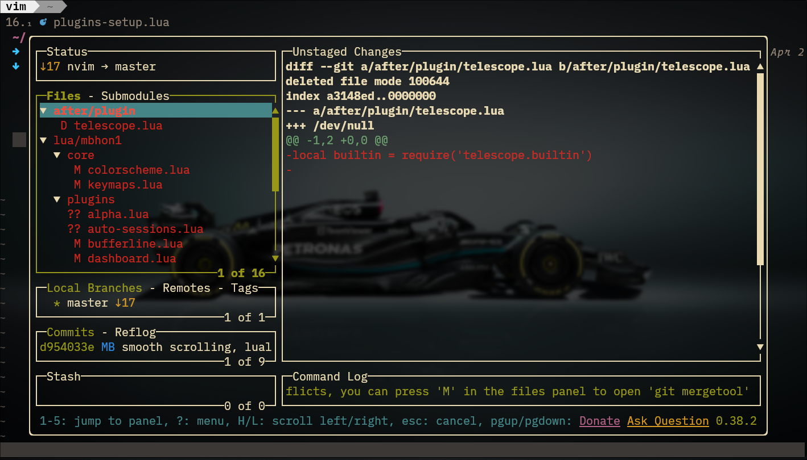

<div align="center">
    <h1>Neovim Config
    <br>
    <a href="https://www.lua.org/">
    
    </a>
    <a href="https://github.com/neovim/neovim">
    
    </a>
    </h1>
</div>

<p align="center">
    <a href="https://github.com/mbhon1/neovim-config/issues">
    
    </a>
    
    
</p>
</p>

## ✍️ Intro

- Highly customisable
- Uses [lazy.nvim](https://github.com/folke/lazy.nvim) as plugin manager

## Installation
<!-- TODO: -->

## ⌨️ Configs and Usage

- Make a backup of your `.config/nivm` before cloning repo.
- Clone the repo `git clone https://github.com/mbhon1/neovim-config ~/.config/nvim`.
- Learn more about tabnine [here](https://www.tabnine.com/) if you wish to use AI assistance.
- Follow the guide on the official repo to enable [live-server.nvim](https://github.com/aurum77/live-server.nvim).

## 🛠️ External Tools

These tools can be installed using your distro's package manager such as `apt`, `pacman`, `yay`, etc.

- lazygit
- nodejs
- npm
- fzf
- git
- ripgrep

## 🐚 Shell

- zsh + starship + kitty



## 📸 Screenshots

Dashboard



Transparency-off



Gruvbox theme



Screensaver



Lazy package manager



Lazygit



## 📂 File Structure

```
 .
├──  ftplugin
│   └──  java.lua
├──  init.lua
├──  lua
│   ├──  core
│   │   ├──  autocommands.lua
│   │   ├──  init.lua
│   │   ├──  keymaps.lua
│   │   ├──  options.lua
│   │   └──  utils.lua
│   ├──  plugin-loader.lua
│   └──  plugins
│       ├──  alpha
│       │   ├──  dashboard.lua.bak
│       │   ├──  init.lua.bak
│       │   └──  startify.lua.bak
│       ├──  alpha.lua
│       ├──  autopairs.lua
│       ├──  buffer-remove.lua
│       ├──  bufferline.lua
│       ├──  cmp.lua
│       ├──  colorizer.lua
│       ├──  comment.lua
│       ├──  dap
│       │   ├──  cpptools.lua
│       │   ├──  debugpy.lua
│       │   ├──  delve.lua
│       │   ├──  init.lua
│       │   ├──  js-debug.lua
│       │   └──  node-debug2.lua
│       ├──  fidget.lua
│       ├──  file-browser.lua
│       ├──  flash.lua
│       ├──  gitsigns.lua
│       ├──  jaq.lua.bak
│       ├──  lsp
│       │   ├──  handlers.lua
│       │   ├──  init.lua
│       │   └──  settings
│       │       ├──  clangd.lua
│       │       ├──  jdtls.lua
│       │       ├──  jsonls.lua
│       │       ├──  lua_ls.lua
│       │       ├──  pyright.lua
│       │       └──  yamlls.lua
│       ├──  lspsaga.lua
│       ├──  lualine
│       │   ├──  components.lua
│       │   ├──  init.lua
│       │   ├──  modes.lua
│       │   └──  theme.lua
│       ├──  navic.lua
│       ├──  neo-tree.lua.bak
│       ├──  neorg.lua.bak
│       ├──  noice.lua
│       ├──  null-ls.lua
│       ├──  nvim-tree.lua
│       ├──  persistence.lua
│       ├──  spectre.lua
│       ├──  tabset.lua
│       ├──  telescope.lua
│       ├──  theme
│       │   ├──  catppuccin.lua
│       │   ├──  dracula.lua
│       │   ├──  gruvbox.lua
│       │   ├──  init.lua
│       │   ├──  kanagawa.lua
│       │   ├──  material.lua
│       │   ├──  nightly.lua
│       │   ├──  onedark.lua
│       │   └──  tokyonight.lua
│       ├──  todo-comments.lua
│       ├──  toggleterm.lua
│       ├──  treesitter.lua
│       ├──  undotree.lua
│       ├──  utils.lua
│       └──  which-key.lua
├──  README.md
├──  Screenshots
│   ├──  alpha.png
│   ├──  code.png
│   ├──  lazy.png
│   ├──  lazygit.png
│   ├──  onefetch.png
│   ├──  transparent-off.png
│   └──  zone.png
├──  snippets
│   ├──  snipmate
│   │   └──  cpp.snippets
│   └──  vscode
│       ├──  cpp.json
│       └──  package.json
└──  stylua.toml
```

## Contributions
