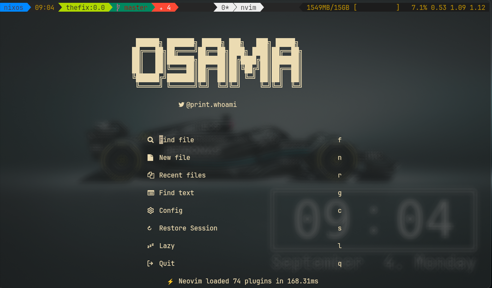

<div align="center">
    <h1>ŌsamaVim
    <br>
    <a href="https://www.lua.org/">
    
    </a>
    <a href="https://github.com/neovim/neovim">
    
    </a>
    </h1>
</div>

<p align="center">
    <a href="https://github.com/mbhon1/neovim-config/issues">
    
    </a>
    
    
</p>

## ✍️ Intro

- Highly customisable
- Uses [lazy.nvim](https://github.com/folke/lazy.nvim) as plugin manager

## Installation
<!-- TODO: -->

## ⌨️ Configs and Usage

- Make a backup of your `.config/nivm` before cloning repo.
- Clone the repo `git clone https://github.com/mbhon1/neovim-config ~/.config/nvim`.
- Learn more about tabnine [here](https://www.tabnine.com/) if you wish to use AI assistance.
- Follow the guide on the official repo to enable [live-server.nvim](https://github.com/aurum77/live-server.nvim).

## 🛠️ External Tools

These tools can be installed using your distro's package manager such as `apt`, `pacman`, `yay`, etc.

- lazygit
- nodejs
- npm
- fzf
- git
- ripgrep

## 🐚 Shell

- zsh + starship + kitty


## 📸 Screenshots

Dashboard



## 📂 File Structure

```
.
├── ftplugin
│  └── java.lua
├── lua
│  ├── core
│  │  ├── autocommands.lua
│  │  ├── init.lua
│  │  ├── keymaps.lua
│  │  ├── options.lua
│  │  └── utils.lua
│  ├── plugins
│  │  ├── alpha
│  │  │  ├── dashboard.lua.bak
│  │  │  ├── init.lua.bak
│  │  │  └── startify.lua.bak
│  │  ├── dap
│  │  │  ├── cpptools.lua
│  │  │  ├── debugpy.lua
│  │  │  ├── delve.lua
│  │  │  ├── init.lua
│  │  │  ├── js-debug.lua
│  │  │  └── node-debug2.lua
│  │  ├── lsp
│  │  │  ├── settings
│  │  │  │  ├── clangd.lua
│  │  │  │  ├── jdtls.lua
│  │  │  │  ├── jsonls.lua
│  │  │  │  ├── lua_ls.lua
│  │  │  │  ├── pyright.lua
│  │  │  │  └── yamlls.lua
│  │  │  ├── handlers.lua
│  │  │  └── init.lua
│  │  ├── lualine
│  │  │  ├── components.lua
│  │  │  ├── init.lua
│  │  │  ├── modes.lua
│  │  │  └── theme.lua
│  │  ├── theme
│  │  │  ├── catppuccin.lua
│  │  │  ├── dracula.lua
│  │  │  ├── gruvbox.lua
│  │  │  ├── init.lua
│  │  │  ├── kanagawa.lua
│  │  │  ├── material.lua
│  │  │  ├── nightly.lua
│  │  │  ├── onedark.lua
│  │  │  └── tokyonight.lua
│  │  ├── alpha.lua
│  │  ├── autopairs.lua
│  │  ├── buffer-remove.lua
│  │  ├── bufferline.lua
│  │  ├── cmp.lua
│  │  ├── colorizer.lua
│  │  ├── comment.lua
│  │  ├── fidget.lua
│  │  ├── file-browser.lua
│  │  ├── flash.lua
│  │  ├── gitsigns.lua
│  │  ├── jaq.lua
│  │  ├── lspsaga.lua
│  │  ├── navic.lua
│  │  ├── neo-tree.lua.bak
│  │  ├── neorg.lua
│  │  ├── neotest.lua
│  │  ├── noice.lua
│  │  ├── null-ls.lua
│  │  ├── nvim-tree.lua
│  │  ├── obsidian.lua
│  │  ├── persistence.lua
│  │  ├── regexplainer.lua
│  │  ├── spectre.lua
│  │  ├── tabset.lua
│  │  ├── telescope.lua
│  │  ├── todo-comments.lua
│  │  ├── toggleterm.lua
│  │  ├── treesitter.lua
│  │  ├── undotree.lua
│  │  ├── utils.lua
│  │  └── which-key.lua
│  └── plugin-loader.lua
├── Screenshots
│  ├── alpha.png
│  ├── code.png
│  ├── lazy.png
│  ├── lazygit.png
│  ├── onefetch.png
│  ├── transparent-off.png
│  └── zone.png
├── snippets
│  ├── snipmate
│  │  └── cpp.snippets
│  └── vscode
│     ├── cpp.json
│     └── package.json
├── init.lua
├── README.md
└── stylua.toml
```

## Contributions

Encounter bugs? Feel free to open issues before submitting a pull request.
